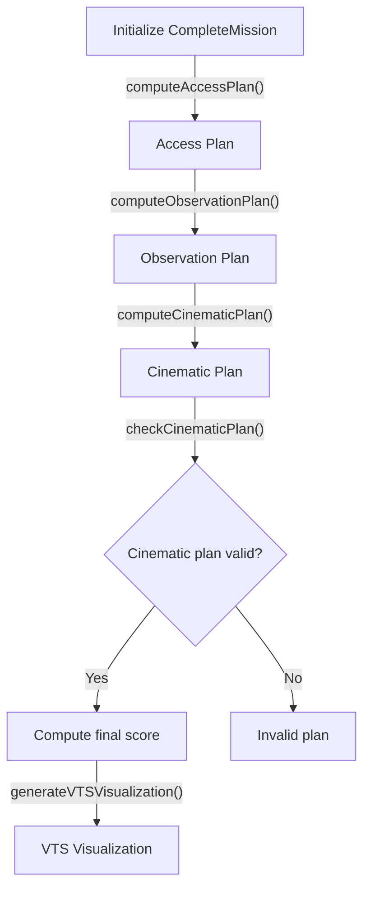
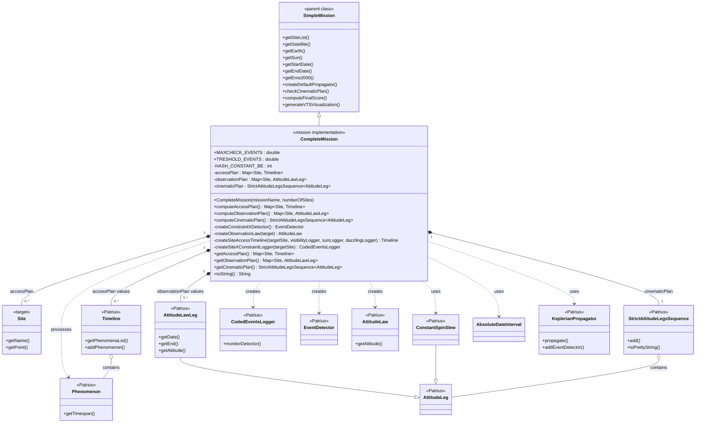

# Making sense of this codebase

## General structure of a run

To run a simulation, one is to execute the `src/test/java/simulation/CompleteMissionMain.java`. This will instantiate a `CompleteMission` object with the mission data and will set off the calculation of the satellite's mission by different steps, each one of which calls a different method of said object. The sequence of calculations goes as:

The `CompleteMission` class follows the UML:

After